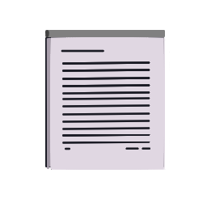

<a name="readme-top"></a>

<div align="center">
  <a href="https://github.com/sennshi/kantantext">
    
  </a>
<h2 align="center">Kantan Text</h2>
  <p align="center">
    Uma ferramenta simples para editar e visualizar arquivos por meio da syntaxe markdown
    <br /><br />
    <div>
      
      
      
      
    </div>
  </p>
</div>

# 💻 Pré-requisitos
Antes de começar você precisa ter instalado:
- ter instalado a versão mais recente do [NodeJs](https://nodejs.org/en/)
- ter o [Yarn](https://yarnpkg.com/) instalado (Entretanto, não é obrigatóriamente necessário, pois podemos utilizar o [NPM](https://www.npmjs.com/) também)

## 🚀 Instalando KantanText
Para instalar o KantanText corretamente, siga as seguintes etapas:
```
git clone https://github.com/sennshi/kantantext.git
```

Após clonar-lo, entre na pasta do projeto e execute:
```
yarn
```
or
```
npm install
```

### ☕ Executando o projeto
Para visualizar a execução do projeto, basta executar:

```
yarn start
```
or
```
npm start
```

Após isso, aparecerá uma janela com a execução do projeto

## 🔨 Feito utilizando
Foram utilizadas as seguintes tecnologias no projeto:
- Javascript
- HTML
- CSS
- [ElectronJs](https://www.electronjs.org/pt/)
- [MarkedJs](https://github.com/markedjs/marked) - responsável pela visualização do markdown

## 🌱 Referências utilizadas
- [Electron JS: Desenvolvendo uma aplicação desktop com HTML, CSS e JavaScript](https://www.youtube.com/watch?v=rBeEvzwI11c&t=3266s)

<div align="right">
  <a href="#readme-top">⬆ Voltar ao topo</a><br>
</div>

---

<div align="center">
  <p>feito com ❤️ por <a href="https://github.com/sennshi">Rodrigo sennshi</a></p>
</div>
